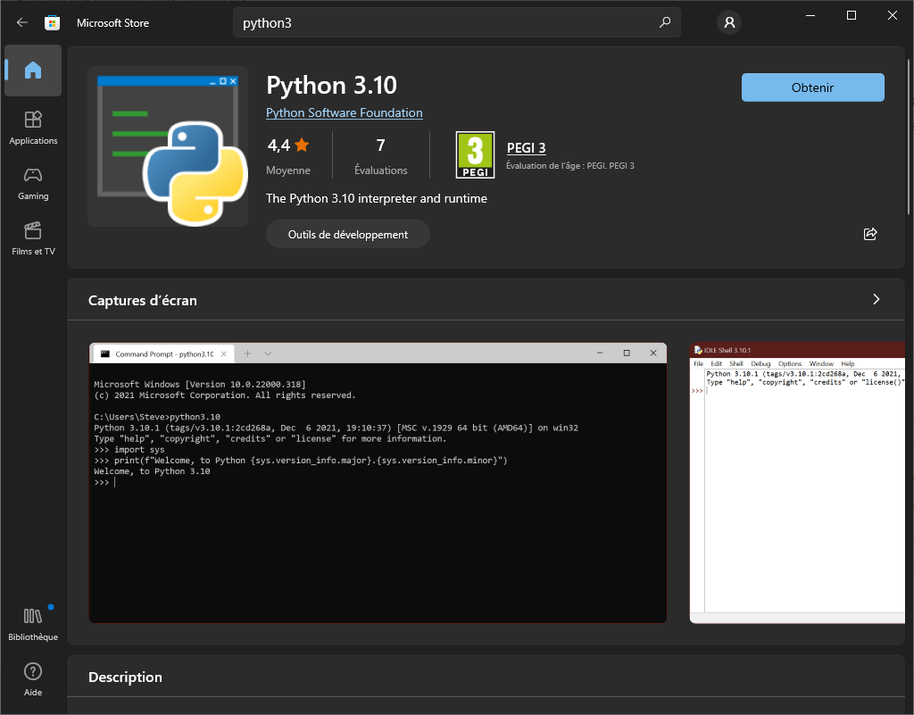
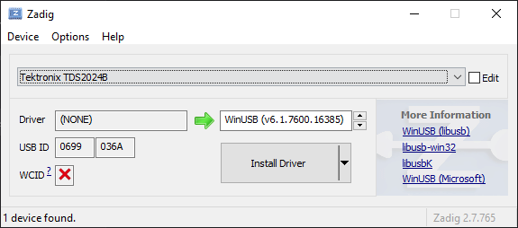

Dumb classes for test instrumentation access
============================================

Florian Dupeyron
October 2021-January 2022

Making this work on windows
---------------------------

Ah sh.t, here we go again...

1. Download some python distribution. You can use the windows store :



2. Install required packages

```
pip3 install -r requirements.txt
```

3. For USB-TMC devices, you need to install the ̀`WinUSB` driver. You can
   download the installer from https://github.com/pbatard/libwdi/releases/.
   Tested version is
   [2.7](https://github.com/pbatard/libwdi/releases/download/v1.4.1/zadig-2.7.exe).

   You should find your TMC devices in the combo box. If not, try to list all
   devices using ̀`Options -> List all devices`. Then, click the `Install Driver`
   or `Replace driver` button.

   

4. You should be able to launch using the python command line. For instance :

   ```
   python3.exe osccap.py IMG_NAME.png
   ```
